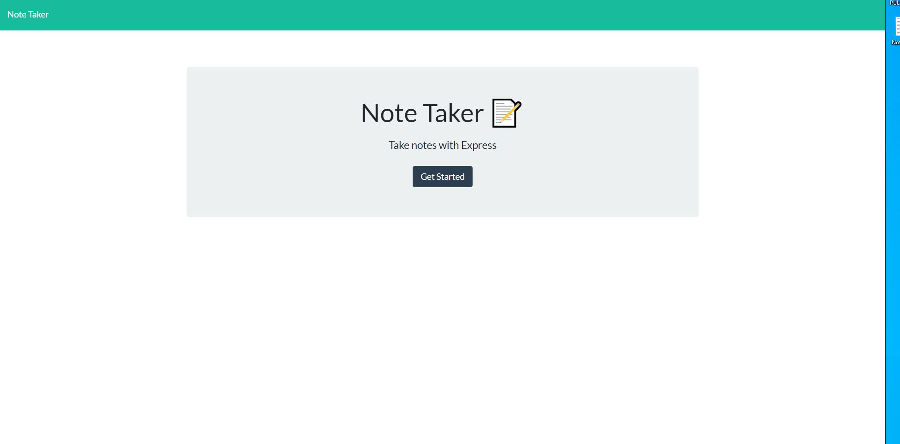
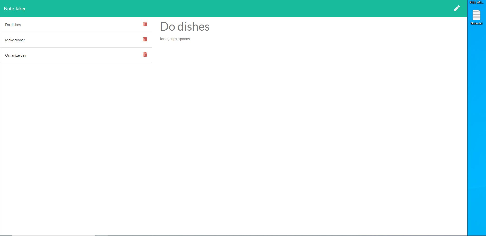

# 11_Note_Taker

# Description

A app created to be used as a note taker put a title and write some notes then save and refresh the page!

# Story

AS A user, I want to be able to write and save notes

I WANT to be able to delete notes I've written before

SO THAT I can organize my thoughts and keep track of tasks I need to complete

# Context

For users that need to keep track of a lot of information, it's easy to forget or be unable to recall something important. Being able to take persistent notes allows users to have written information available when needed.

# Acceptance Criteria

Application should allow users to create and save notes.

Application should allow users to view previously saved notes.

Application should allow users to delete previously saved notes.

# Screenshots

# Deployed Application

https://whispering-atoll-27703.herokuapp.com/

# Table of Contents

- [Description](#Description)
- [Story](#Story)
- [Context](#Context)
- [Screenshots](#Screenshots)
- [Installations](#Installations)
- [Usage](#Usage)
- [License](#License)
- [Credits](#Credits)
- [Test](#Test)
- [Contributing](#Contributing)
- [Issues](#Issues)

# Installations

> npm i and node server.js

# Usage

You can use this application to quickly take notes on anything you need to write down.

# License

None

# Credits

Tony Crosby

# Test

there is no test

# Contributing

By commiting early and often

# Issues

> Having a problem with the loading of the saved notes on the same page but when you refresh the page they are there
